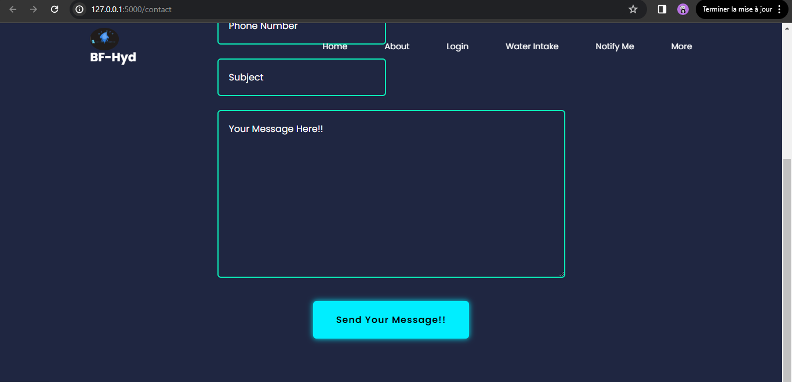

<center>
    <h1> BF-Hyd (Be Forever Hydrated)</h1>
</center>  
  
<p align="center">
  
</p>

## Description

BF-Hyd is an application that helps users track their daily water intake and reminds them to stay hydrated throughout the day. I chose this name to be simple and easy to spell and remember. and also there are other topics in this project like help the user to calculate their age, and Calculate their Body Mass Index... etc, and also there is a small weather application beautifull and cute. I hope you all like [This Project](https://github.com/soukiitos/BF-Hyd)

---

## Team

This is an individual project. I am Soukaina Lachheb, and I developed this project alone, taking it as a challenge.  
  

------------------------------------
| Repository | Files | Description |
|------------|-------|-------------|
|            |[README.md](https://github.com/soukiitos/BF-Hyd/blob/main/README.md)|A README file containing the project's description|
|            |[run.py](https://github.com/soukiitos/BF-Hyd/blob/main/run.py)| The main script of BF-Hyd, serving as its entry point. It includes:
|            |       | - Import statements  
|            |       | - Initialization of Flask App and Configuration  
|            |       | - Database Setup  
|            |       | - Mail Configuration  
|            |       | - Web Push Configuration  
|            |       | - Routes and View Functions  
|            |       | - Background Task Scheduling  
|            |       | - Execution of the Flask App |
|        |[requirement.txt](https://github.com/soukiitos/BF-Hyd/blob/main/requirements.txt)|A file containing all the required packages used in the project, generated using the command `pip freeze > requirements.txt`|
|    |[setup_mysql.sql](https://github.com/soukiitos/BF-Hyd/blob/main/setup_mysql.sql)|A script creating a MySQL database named BFHyd_db and setting up a user account to access and manage this database|
|      |[forms.py](https://github.com/soukiitos/BF-Hyd/blob/main/forms.py)|A file containing form classes using Flask-WTF to define and handle web forms in a Flask application|
|    |[alert.py](https://github.com/soukiitos/BF-Hyd/blob/main/alert.py)|A script utilizing the Pushbullet API to send notifications to specified devices. It reads the content of a file named message.txt and sends a notification with its content to a specified device. The notification's title is set to "Please Remember"|
||[message.txt](https://github.com/soukiitos/BF-Hyd/blob/main/message.txt)|A file containing the message the user will receive|
||vapid_private.pem|A file likely containing a private key generated using the Elliptic Curve (EC) cryptography algorithm with the prime256v1 curve, used for VAPID (Voluntary Application Server Identification) authentication tokens|
||private_key.txt|Contains the Base64-encoded representation of the private key for VAPID authentication in web push notification systems|
||public_key.txt|Contains the Base64-encoded representation of the corresponding public key|
||[__init__.py](https://github.com/soukiitos/BF-Hyd/blob/main/__init__.py)|A file signifying that the directory containing it is a Python package|
|[models](https://github.com/soukiitos/BF-Hyd/tree/main/models)|user.py|Contains the definition of the User class, representing the structure of user data stored in the database|
|[models](https://github.com/soukiitos/BF-Hyd/tree/main/models)|water_intake.py|Contains the definition of the WaterIntake class, representing the structure of WaterIntake data stored in the database|
|[models](https://github.com/soukiitos/BF-Hyd/tree/main/models)| masscalculator.py|Contains the definition of the MassCalculatorData class, representing the structure of MassCalculatorData data stored in the database|
|[models](https://github.com/soukiitos/BF-Hyd/tree/main/models)|__init__.py|Makes the db instance accessible throughout the package, facilitating database operations within the Flask application|
|[static\css](https://github.com/soukiitos/BF-Hyd/tree/main/static/css)|.|Contains CSS files styling HTML elements, organizing HTML files, and providing a responsive design|
|[static\script](https://github.com/soukiitos/BF-Hyd/tree/main/static/script)| . |Contains JavaScript files providing functionality and interactivity to HTML pages|
|[static\images](https://github.com/soukiitos/BF-Hyd/tree/main/static/images)|.|Contains all images used in the project|
|[templates](https://github.com/soukiitos/BF-Hyd/tree/main/templates)|[index.html](https://github.com/soukiitos/BF-Hyd/blob/main/templates/index.html)|The homepage for BF-Hyd|
|[templates](https://github.com/soukiitos/BF-Hyd/tree/main/templates)| . |HTML files serving as templates for generating dynamic web pages in BF-Hyd|

## Virtual Environnement

I named the virtual environnemet [BF-Hyd](), to create it i used the command:
```command
python -m venv BF-Hyd
```  
and to activate it i used the command:
```command
BF-Hyd\Scripts\activate
```  
to deactivate it:
```command
deactivate
```  

## Installation

To install the required packages, run:
```bash
pip install -r requirements.txt
```

## Some BF-Hyd Pages Images:

- The [homepage]((https://github.com/soukiitos/BF-Hyd/blob/main/templates/index.html)) here is a snippest of how it looks like:
<p align="center">
  
</p>  

- I used a card to talk a bit about my portfolio and give a small Description of this project, and some of languages i used, here is the about card:  

<p align="center">
  
</p>  

- I tried to bring the user closer to the application, so i created [Contact Us](https://github.com/soukiitos/BF-Hyd/blob/main/templates/contact.html) form to communicate with us: here is a how it looks like:
<p align="center">
  
</p>
<p align="center">
  
</p> 

- I tried to make the user love this application and visit it time by time, i did a age calculator and Mass Body Calculator forms, here are how they look like:  

<p align="center">
  
</p>
<p align="center">
  
</p>  

- I did a small Weather Application, so we know that the weather is related to hydration, that's why i wanted to make the user aware of everything to stay healthy. here is how the app looks like:  
<p align="center">
  
</p>  

- To make this app funny, i wanted the user to discover a lot of things and make hiw enjoy visiting it, i did a Virtuel X-ray Experience, here is how it looks like:
<p align="center">
  
</p>

## API'S: